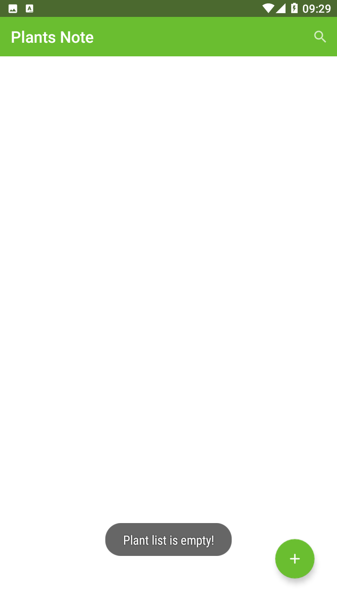
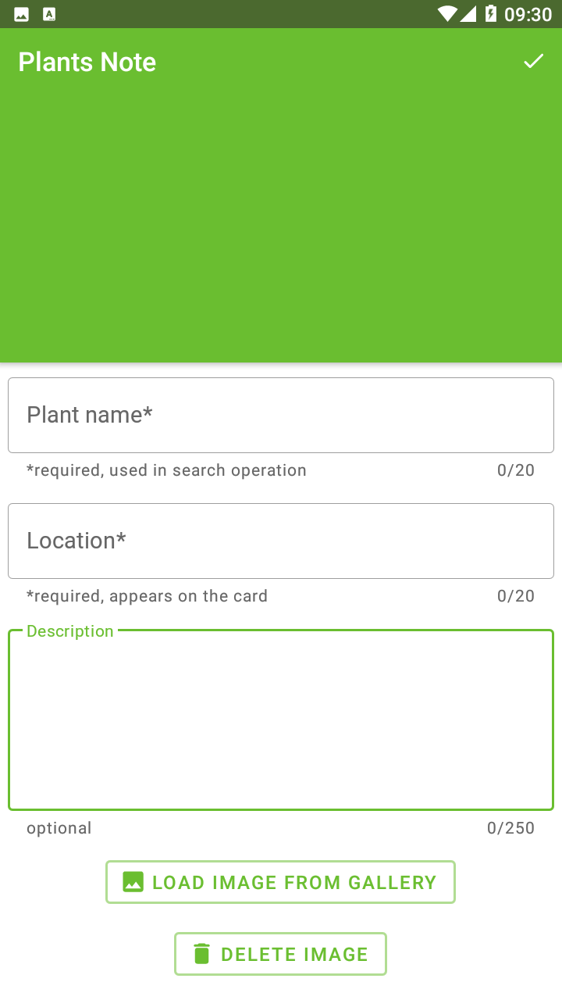
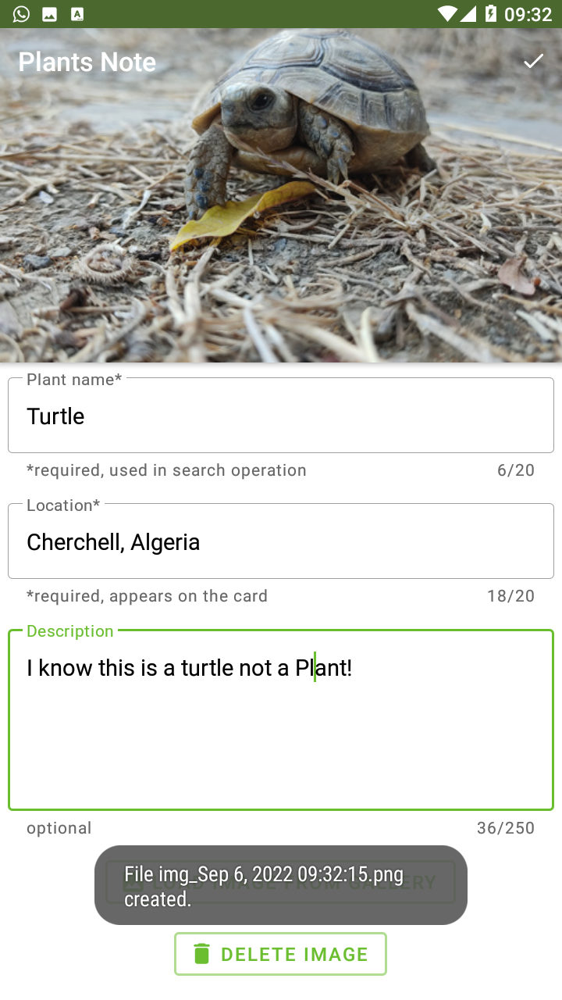
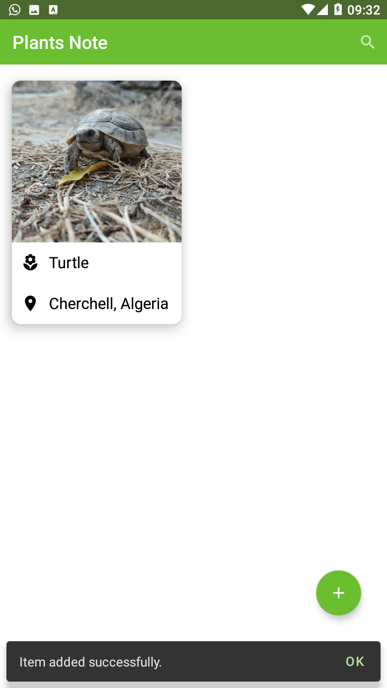
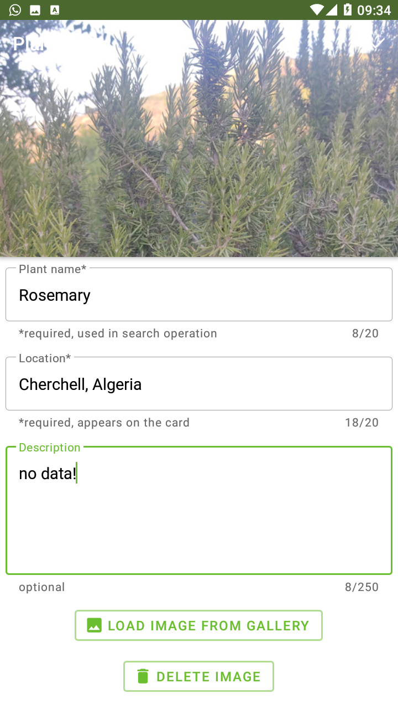
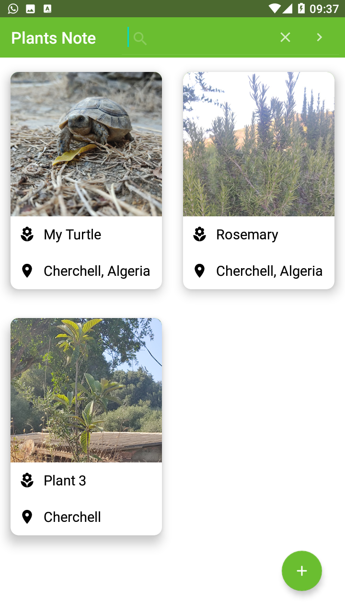
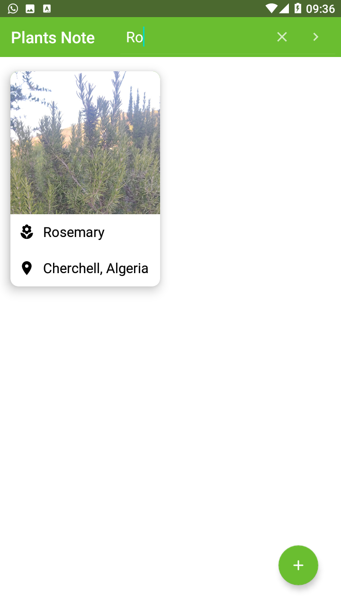
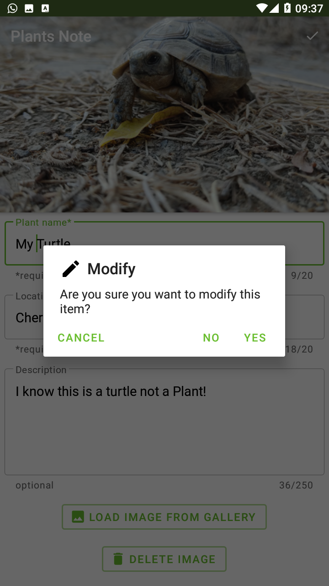
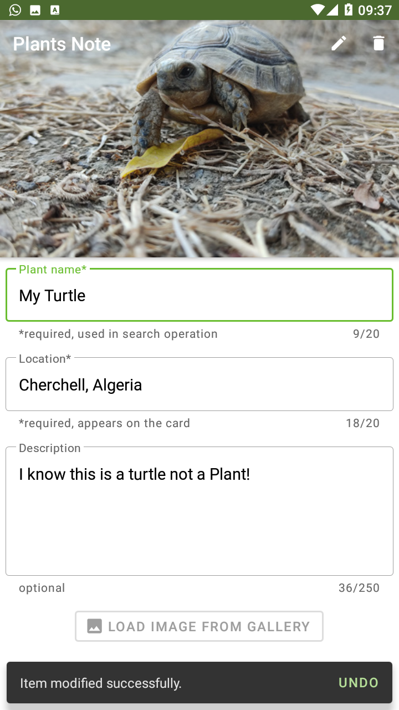
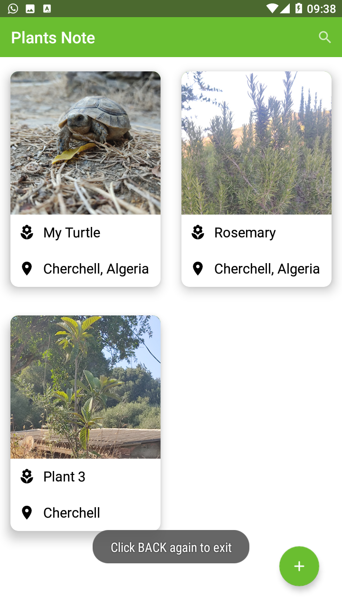

# Plants-Note
This is a mobile app project that represents a note of plants, and it is created for training purpose. you may need to see a part/all of the project's code if you are interested in one/all of the partitions used to build it:

-Material design (MaterialToolbar, TextViewEditText, FloatingActionBar..).
-Getting access to public external storage using ARL and getting an image then making a copy of it and storing it in the internal storage of the app 
          & taking READ_EXTERNAL_STORAGE permission from the user by showing the permissions dialog.
-CRUD operations on internal database (create ,retrieve, update, delete).
-Dealing with internal SQLite database (storing an image to database as URI, and other data such Plant's name and location).
-Recyclerview (adapter with recyclerview item click listener interface).
-Menu (includes search for Recyclerview items by Plant name from the database, then showing them in the recyclerview every time the search text changes).
-Snackbars with actions (UNDO: when deleting or modifying and OK: when adding a Plant item).
-the user has to click twice on back button in 2s to exit from the app in the MainActivity.

if you want to install Plants Note on your Android device : [Download APK file](https://www.mediafire.com/file/7b0mdkbj4tgc7tc/Plants-Note.apk/file)

<table>
  <tr>
    <td>List Empty</td>
     <td>Add Plant</td>
     <td>Fill Fields</td>
  </tr>
  <tr>
    <td></td>
    <td></td>
    <td></td>
  </tr>
          
   <tr>
    <td>Item Inserted</td>
     <td>Add Another Item</td>
     <td>Many Items</td>
  </tr>
  <tr>
    <td></td>
    <td></td>
    <td></td>
  </tr>
          
  <tr>
    <td>Search</td>
     <td>Modify Item</td>
     <td>Item Modified</td>
  </tr>
  <tr>
    <td></td>
    <td></td>
    <td></td>
  </tr>
          
   <tr>
    <td>Click Again To Exit</td>
  </tr>
  <tr>
    <td></td>
  </tr>
 </table>
